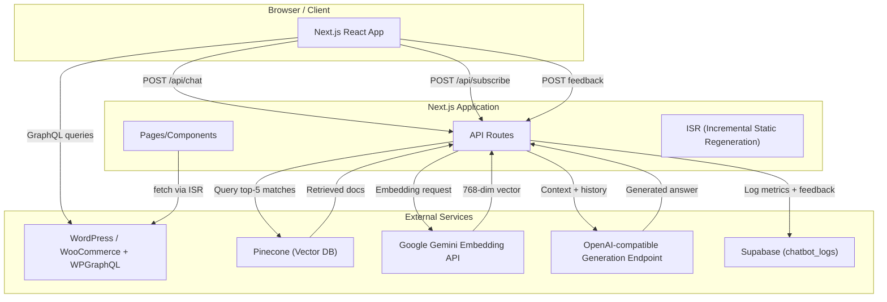

<div align="center">
  <h1>🚿 Parts Plumbing Store</h1>
  <p><strong>Headless e‑commerce catalog for sanitary & plumbing supplies</strong></p>
  <p>Discover, search, and inquire about products with AI‑assisted support — powered by Next.js, WordPress/WooCommerce, and a RAG pipeline.</p>
  <p>
    <a href="#-quick-links">Explore Docs</a> •
    <a href="https://github.com/your-username/parts-plumbing-store/issues/new?template=bug_report.md">Report Bug</a> •
    <a href="https://github.com/your-username/parts-plumbing-store/issues/new?template=feature_request.md">Request Feature</a> •
    <a href="https://your-live-demo-url.com">Live Demo</a>
  </p>

  <!-- Badges -->
  <p>
    
    
    
    
    
    
    
    
  </p>
</div>

---

## 📖 Table of Contents

- [🚀 Project Overview](#-project-overview)
- [✨ Core Features](#-core-features)
- [🧩 System Architecture](#-system-architecture)
- [⚙️ Tech Stack](#️-tech-stack)
- [🏁 Getting Started](#-getting-started)
- [🔐 Environment Variables](#-environment-variables)
- [📡 API Reference](#-api-reference)
- [🧪 Testing & Quality](#-testing--quality)
- [🗺️ Roadmap](#️-roadmap)
- [👤 Author & Contact](#-author--contact)

---

## 🚀 Project Overview

Parts Plumbing Store is a **headless e‑commerce catalog** built for a sanitary and plumbing supplies business serving customers in Pakistan, especially Khyber Pakhtunkhwa (KPK). It offers a modern, fast, and searchable public website while keeping product data managed in WordPress/WooCommerce.

**The problem:** Customers need a fast, accessible way to discover products, compare options, and contact the store without relying on in‑person visits or phone calls. The store requires a manageable catalog where data stays in WordPress, but the public frontend is modern, responsive, and optimized for inquiries.

**Our solution:** A Next.js app with React, Tailwind, and a GraphQL backend that powers:

- Product browsing with ISR and client‑side caching.
- Powerful search and filtering (by category, brand, price, and text).
- AI‑assisted chat using a **RAG pipeline** with Pinecone and Supabase.
- WhatsApp‑driven inquiry flows for instant customer contact.
- SEO‑friendly metadata, sitemaps, and robots.

### ✨ Key Highlights

| Visitor / Shopper                                           | Support Agent / Store Staff                | AI Quality Reviewer                       |
| ----------------------------------------------------------- | ------------------------------------------ | ----------------------------------------- |
| Browse categories and products instantly                    | Receive inquiries via WhatsApp/phone/email | Review chat logs and feedback in Supabase |
| Search and filter the catalog with live suggestions         | Simulated contact form (future backend)    | Analyze retrieval precision & accuracy    |
| View product details, variations, and pricing               | Admin UI out of scope                      | Use feedback to improve the RAG pipeline  |
| Ask the AI assistant for help, backed by the knowledge base |                                            |                                           |
| Initiate WhatsApp inquiries with pre-filled messages        |                                            |                                           |
| Subscribe to newsletters with email validation              |                                            |                                           |

> 🖼️ **Screenshot / Demo**
>
> _[Add a GIF or screenshot of the product listing, AI chat, or mobile view here]_
> `<!-- Example:  -->`

---

## ✨ Core Features

### 🔍 Catalog & Product Discovery

- **Headless WordPress/WooCommerce** – Products, categories, variations, and images are fetched via GraphQL.
- **Incremental Static Regeneration (ISR)** – Product pages revalidate every 3600 seconds for fresh content.
- **Client‑side caching** – Product list stored in `localStorage` for one hour (key `kpk_all_products`).
- **Responsive product grid** with featured cards (every 5th product is larger).
- **Product detail** with breadcrumbs, description toggle, variation selection, and price matching.
- **404 handling** for missing products.

### 🔎 Search & Filtering

- **Global search overlay** (animated portal) with live suggestions from cached products.
- **Client‑side filtering** by category, brand, min/max price, and search term, persisted in URL query parameters.
- **Empty state** with a clear‑filters action when no results match.

### 🤖 AI Chat Assistant (RAG)

- **Floating chat widget** with desktop panel and mobile full‑screen modes.
- **Retrieval‑Augmented Generation (RAG)** pipeline:
  1. User question embedded via **Google Gemini**.
  2. Pinecone vector search retrieves top‑5 knowledge documents (score > 0.7).
  3. Context + history sent to an **OpenAI‑compatible** generation endpoint.
- **Conversation context** maintained; history compaction via summarization.
- **Markdown rendering** (GFM) with safe external links.
- **User feedback** (👍/👎) – optimistically updated and debounced to Supabase.
- **Support follow‑up** triggered on dislike.

### 💬 Contact & WhatsApp Integration

- WhatsApp links in header, home, categories, contact page, and product detail.
- **Product‑specific inquiry messages** – generated with variation, price, and attributes.
- Contact cards for phone, email, address, business hours.
- Google Maps embed and FAQ accordion.
- Simulated contact form (UI only; no backend yet).

### 📝 Newsletter & SEO

- Email subscription form with client‑side API validation (`/api/subscribe`).
- **SEO** – dynamic metadata, Open Graph tags, product‑specific metadata, sitemap (`/sitemap.js`), and robots (`/robots.js`).

---

## 🧩 System Architecture



## ⚙️ Tech Stack

| Layer                | Framework / Tool                              | Purpose                                                         |
| -------------------- | --------------------------------------------- | --------------------------------------------------------------- |
| Frontend             | Next.js 16, React 19, Tailwind CSS 4          | App Router, server components, client interactions, and styling |
| Frontend tooling     | Framer Motion, Lucide React, Sonner           | Animations, icons, and toast notifications                      |
| Data integration     | WPGraphQL, `graphql-request`                  | Fetch products, categories, and variations from WordPress       |
| AI and vector search | Google Gemini embeddings, Pinecone            | Embed questions and retrieve knowledge documents                |
| Generation           | OpenAI-compatible generation API              | Generate concise, grounded answers                              |
| Logging              | Supabase JavaScript client                    | Store chat metrics and user feedback                            |
| Development          | ESLint, Prettier, Vitest, Playwright          | Linting, formatting, unit tests, and E2E tests                  |
| Deployment           | Docker (optional), Vercel, or Node.js hosting | Containerized or standard Node deployment                       |

## 🏁 Getting Started

### Prerequisites

- Node.js v20+ (or the latest LTS)
- npm or yarn
- Docker (optional, for containerized setup)
- A running instance of WordPress with WooCommerce and WPGraphQL, or the provided Pantheon endpoint for development
- A Pinecone index and Supabase project for AI features
- API keys for Gemini and the generation endpoint

### Local Setup

1. Clone the repository:

   ```bash
   git clone https://github.com/your-username/parts-plumbing-store.git
   cd parts-plumbing-store
   ```

2. Install dependencies:

   ```bash
   npm install
   ```

3. Configure environment variables.

Copy .env.example to .env.local (frontend) and adjust variables (see Environment Variables below).

Copy .env.example to .env (backend) if needed.

4. Run the development server:

   ```bash
   npm run dev
   ```

The app will be available at <http://localhost:3000>.

### Build for Production

```bash
npm run build
npm start
```

### Docker Compose

If you have Docker and Docker Compose installed, you can run the entire stack with a single command:

```bash
docker-compose up -d
```

This starts the Next.js app in production mode using environment variables from `.env`. WordPress, Pinecone, Supabase, and AI services are external and must be running separately.

## 🔐 Environment Variables

The following variables are required for the application to function.

> Variables prefixed with `NEXT_PUBLIC_` are exposed to the browser. Use them only for safe values such as public API endpoints.

| Variable                                 | Required | Description                                                                          |
| ---------------------------------------- | -------- | ------------------------------------------------------------------------------------ |
| `NEXT_PUBLIC_WORDPRESS_GRAPHQL_ENDPOINT` | Yes      | GraphQL endpoint for WordPress/WooCommerce (currently hardcoded in `lib/graphql.js`) |
| `NEXT_PUBLIC_WHATSAPP_NUMBER`            | Optional | Primary WhatsApp number for inquiries (used in `VariationSelector`)                  |
| `NEXT_PUBLIC_SITE_URL`                   | Yes      | Base URL for metadata, sitemap, and robots, such as `https://example.com`            |
| `NEXT_PUBLIC_SUPABASE_URL`               | Yes      | Supabase project URL                                                                 |
| `NEXT_PUBLIC_SUPABASE_ANON_KEY`          | Yes      | Supabase anonymous key                                                               |
| `NEXT_PUBLIC_GEN_AI_URL`                 | Yes      | URL of the OpenAI-compatible generation endpoint                                     |
| `NEXT_PUBLIC_GEN_AI_API_KEY`             | Yes      | API key for the generation endpoint, used as a Bearer token                          |
| `EMBEDDING_MODEL`                        | Yes      | Model name for Gemini embedding, such as `models/embedding-001`                      |
| `EMBEDDING_MODEL_API_KEY`                | Yes      | API key for the Google Gemini embedding API                                          |
| `PINECONE_HOST`                          | Yes      | Pinecone index host URL                                                              |
| `PINECONE_API_KEY`                       | Yes      | Pinecone API key                                                                     |

## 📡 API Reference

<details>
<summary><strong>Click to expand API endpoints</strong></summary>

| Endpoint                                                          | Method | Access | Description                                                             |
| ----------------------------------------------------------------- | ------ | ------ | ----------------------------------------------------------------------- |
| `/api/chat`                                                       | `POST` | Public | Generate an AI response using the RAG pipeline.                         |
| `/api/subscribe`                                                  | `POST` | Public | Validate an email address for newsletter subscription (no persistence). |
| `/api/conversations/:conversationId/messages/:messageId/feedback` | `POST` | Public | Save user feedback (like/dislike) for a chat message.                   |

### Example: `POST /api/chat`

```json
{
  "conversationId": "abc-123",
  "userQuestion": "What is your return policy?",
  "history": [
    { "role": "user", "content": "..." },
    { "role": "assistant", "content": "..." }
  ]
}
```

### Success Response

```json
{
  "id": "chatbot-log-id",
  "role": "assistant",
  "content": "Our return policy allows...",
  "needsSupport": false,
  "supportQuery": "What is your return policy?",
  "supportContext": {
    "conversationId": "abc-123",
    "model": "openai/gpt-oss-120b"
  }
}
```

</details>

## 🧪 Testing & Quality

We use Vitest for unit tests and Playwright for end‑to‑end testing.

```bash
# Run unit tests (watch mode)
npm run test

# Run unit tests with coverage
npm run coverage

# Run Playwright E2E tests (requires dev server running)
npm run test:e2e

# Lint and format
npm run lint
npm run format

# Validate everything (audit, lint, format, test, build)
npm run validate
```

## 🗺️ Roadmap

- [ ] Full cart, checkout, and payment flow
- [ ] Customer accounts and order tracking
- [ ] Persistent newsletter subscriber storage with unsubscribe
- [ ] Backend-backed contact form for email or CRM delivery
- [ ] Admin dashboard for support requests and chat review
- [ ] Live inventory and availability checks
- [ ] Server-side catalog filtering instead of fetching all products client-side
- [ ] Dynamic categories from WordPress instead of static cards
- [ ] Product recommendations and related products
- [ ] Wishlist or quote requests for contractors
- [ ] Better product image galleries with carousel and zoom
- [ ] Accessibility audit and improvements
- [ ] API rate limiting and bot protection
- [ ] Sanitization layer for CMS-provided HTML
- [ ] Unified configuration for store name, phone, email, and address
- [ ] CI pipeline for lint, format, unit tests, E2E tests, and builds
- [ ] Analytics for search terms, category clicks, product views, and WhatsApp conversions
- [ ] Multilingual support for English, Urdu, and Pashto

## 👤 Author & Contact

**Your Name** – Lead Developer & Maintainer

- [GitHub](https://img.shields.io/badge/GitHub-@yourusername-181717?logo=github&style=flat-square)
- [LinkedIn](https://img.shields.io/badge/LinkedIn-yourprofile-0A66C2?logo=linkedin&style=flat-square)
- [Portfolio](https://img.shields.io/badge/Portfolio-your.site-000000?style=flat-square)

For questions, suggestions, or contributions, please open an issue or reach out via the contact methods above.

This project is actively maintained. Contributions are welcome; please read the contributing guidelines before submitting a pull request.
